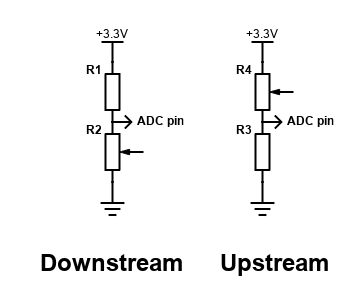

# bbn_sensors_hub_C
NMEA 0183 XDR sensors on esp32. Engine

- Thermocouple sensor for exhaust temperature
- Engine RPM
- Resistive sensors 240-33 ohms or 10-180 ohms support for fuel level, engine oil pressure, rudder position, or trim
- IR Open Flame sensor
- i2c connector for more external i2c sensors supported by the Hub C firmware

<p align="center">


</p>

<p align="center">


</p>

### Enclosure, etc

- Waterproof box. Hinged with stainless steel hardware, transparent lid, base plate and legs
- Various cable glands
- Grove cables from m5stack
- M3 standoffs
- __In-Sure lever wire connectors__ for splicing wires (3-Port): https://www.idealind.com/us/en/category/product.html/In_Sure_Lever_3_Port.html
- Cable ties
- __Grove2Dupont Conversion Cables__: https://shop.m5stack.com/products/grove2dupont-conversion-cable-20cm-5pairs
- USB-C to USB-A cables with small support tang on USB-C end

## Hardware

- M5Stack __AtomS3-lite__ esp32: https://shop.m5stack.com/products/atoms3-lite-esp32s3-dev-kit
- __MAX6675__ thermocouple sensor (break out board and K-type sensor probe): https://www.amazon.com/HiLetgo-MAX6675-Thermocouple-Temperature-Arduino/dp/B01HT871SO
- __PC817 Optocoupler__ (with breakout board for your alternator voltage range): https://www.amazon.com/EL817-Optocoupler-Isolation-Board-Amplification/dp/B01L1OI1HC/
- M5stack __ATOMIC PortABC Extension Base__: https://shop.m5stack.com/products/atomic-portabc-extension-base
- Resistor __100 Ohm__
- __Open Flame IR Sensor__ (3-pin, 760nm-1100nm wavelength detection): https://www.amazon.com/Detection-Infrared-Receiver-Control-760nm-1100nm/dp/B09135QZMQ

### MAX6675 thermocouple sensor

Connected to M5Stack AtomS3-Lite via GPIO pins:

SO = 5

CS = 6

CLK = 7

#### Use cases

- Higher Temperature Ranges
- Exhaust gas temperature

### Engine RPM from Alternator terminal W (waveform)

Input from alternator connected to optocoupler:

- Alternator ground to Board '-' INPUT on 2-pin terminal
- Alternator 'W' to Board '+' INPUT on 2-pin terminal

Output to esp32:

- Board 3-pin output terminal GND to esp32 GND
- Board 3-pin output terminal VCC to esp32 VCC
- Board 3-pin output terminal OUT to analog input pin on esp32 (browse the code to see the pin assignement)

The optocoupler converts sine wave form signal from alternator to digital impulses,
and this firmware uses esp32 built-in pulse counter to count pulses and determine engine RPM.
Debouncing logic is applied by built-in esp32 pulse counter to avoid counting noise as pulses.

### Oil pressure, Fuel Level, Rudder Position, Trim resistive sensor

In order to measure the resistance you can measure voltage using ADC (analog) input esp32 pin on a voltage divider circuit.

Voltage divider circuit consists of:

- Resistor of a known resistance
- Sensor's resistor for which resistance is to be measured
- Known reference voltage (3.3v for esp32 case, use +3.3v pin (not +5v)) applied to those two resistors connected in series

Voltage is measured on ADC (analog) input pin of esp32 connected in between those two resistors.

Ohm Law can be used to calculate unknown resistance from voltage drop (knowing reference voltage and reference resistor resistance)

There are two kinds of configurations for this circuit:

Either the variable resistor is close to GND (DOWNSTREAM) or it is closer to VCC (UPSTREAM).





$$
\begin{flalign}
\text{ Downstream: } \newline \newline
&  \large {V _{ref} \over {R _{ref} + R _{sensor}}} = {V _{meas} \over {R _{sensor}}} \text{ } \Rightarrow \text{ }
R _{sensor} = {R _{ref} {V _{meas} \over {V _{ref} - V _{meas}}}} &
\end{flalign}
$$


$$
\begin{flalign}
\text{ Upstream: } \newline \newline
&  \large {V _{ref} \over {R _{ref} + R _{sensor}}} = {V _{meas} \over {R _{ref}}} \text{ } \Rightarrow \text{ }
R _{sensor} = {R _{ref} {{V _{ref} - V _{meas}} \over V _{meas}}} &
\end{flalign}
$$


#### esp32 ADC

esp32 ADC is not the best:

- The ESP32 has two 12-bit ADCs
- Noisy (can be corrected by statistical sampling which will reduce sampling rate for accurate measurements)
- Non-linear (can be corrected by polynomial approximation)
- Almost ignores ranges < 0.14v and > 2.6v
- The ESP32 ADC can measure voltage levels between 0 V and 3.3 V. The measured voltage is assigned a value between 0 and 4095, with 0 V corresponding to 0 and 3.3 V corresponding to 4095
- ADCs in the esp32 have an attenuator stage at their inputs; the suggested range for 11Db attenuation is 2600mV at best (even though the ADC's range is 0-3.3v)
- However, the output can be made accurate to within 1% on input range of 0.14 to 2.6 volts

For precise measurements use external ADC

Examples:
- ADS1115  https://docs.m5stack.com/en/unit/vmeter
- INA219   https://www.adafruit.com/product/904

#### Getting 3.3v from m5stack

You solder a wire to +3.3v pad of m5stack portABC. That wire passes under m5atom connected to portABC via
specially designed gap. Connect 100 Ohm resistor to it.

#### Resistive boat sensors

There are two types of commonly used resistance based sensors:
- European 0-190 ohms range (often 10-180 ohms working range)
- American Standard 240-33 ohms

Examples:

- Fuel level (10-180 Ohm or 0-190 Ohm range)
- Oil pressure
- Rudder position (10-180 Ohms)
- Trim
- Resistive Temperature Sensors

Pick (100 Ohm) resistor with lower % tolerance.

### Open Flame IR Sensor

Browse the source code for pin assignement.

## Loading Firmware

### On Bareboat Necessities (BBN) OS (full)

Long press side button on atomS3 till you see green to enter the mode for uploading firmware.

NOTE: /dev/ttyACM1 in the script below is for example. In your case device name might be different. You can find out what it is by inspecting differences in output of

```bash
ls -ltr /dev/tty*
```

with the device unplugged from USB and plugged into USB.

```bash
# shutdown signalk
sudo systemctl stop signalk

if [ -f bbn-flash-sensors-hub-C.sh ]; then rm bbn-flash-sensors-hub-C.sh; fi
wget https://raw.githubusercontent.com/bareboat-necessities/my-bareboat/refs/heads/master/m5stack-tools/bbn-flash-sensors-hub-C.sh
chmod +x bbn-flash-sensors-hub-C.sh
./bbn-flash-sensors-hub-C.sh -p /dev/ttyACM1
```

### Reading Serial Port

on USB-C port with baud rate 38400

```bash
stty -F /dev/ttyACM1 38400
socat stdio /dev/ttyACM1
```

## Example Output

````
$BBTXT,01,01,01,FirmwareTag: bbn_sensors_hub_C*48
$BBXDR,T,1999.8,R,RPM*19
$BBXDR,S,1,,OPEN_FLAME*24
$BBXDR,T,2000.1,R,RPM*1A
$BBXDR,C,21.50,C,THERMOCOUPLE*6F
$BBXDR,T,1998.1,R,RPM*11
$BBXDR,G,327.5,O,Ohms_esp32*6A
````

## Integration with SignalK

Integration with SignalK is done via NMEA XDR Parser SignalK plugin.

More: https://github.com/GaryWSmith/xdr-parser-plugin

Recommended config file for XDR Parser SignalK plugin:

https://github.com/bareboat-necessities/lysmarine_gen/blob/bookworm/install-scripts/4-server/files/xdrParser-plugin.json


## Other Bareboat Necessities Devices

Project Home:  https://bareboat-necessities.github.io/

- Alarms Box: https://github.com/bareboat-necessities/bbn_alarms_A
- Sensors Hub: https://github.com/bareboat-necessities/bbn_sensors_hub_AB
- NMEA N2K to USB: https://github.com/bareboat-necessities/bbn-m5-s3-n2k-usb
- Instruments Displays on esp32: https://github.com/bareboat-necessities/bbn-m5stack-tough
- Boat Heave Sensor: https://github.com/bareboat-necessities/bbn-wave-period-esp32
- I2C over USB for Linux: https://github.com/bareboat-necessities/bbn-i2c-over-usb
